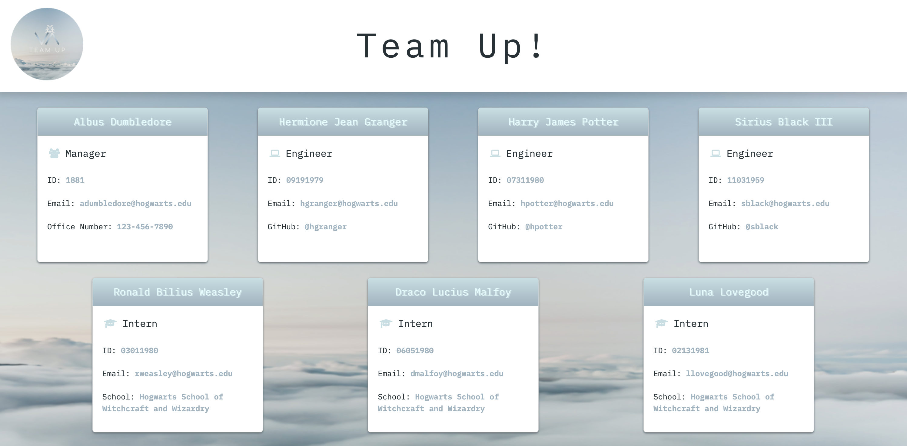

<h1 align="center"> Team Up </h1>

<p align="center">
    
  <br>
  <i>Team Profile Generator
    <br> built using Node.js.</i>
  <br>
</p>
<br>


---
## Description

Team Up is a back-end application that generates an HTML webpage that displays summaries for each employee on a software engineering team. 

All you need to do is enter a few simple pieces of information, and this tool will generate a document that provides managers an easy way to navigate through his/her team's important information. 

## Table of Contents
- [Description](#description)
- [Table of Contents](#table-of-contents)
- [Installation](#installation)
  - [Cloning the Repository](#cloning-the-repository)
  - [Prerequisites](#prerequisites)
  - [Setting Up](#setting-up)
- [Mock-Up](#mock-up)
- [Usage](#usage)
- [Tests](#tests)
  - [Prerequisites](#prerequisites-1)
  - [Running Tests](#running-tests)
- [Questions](#questions)
- [Contributing](#contributing)
  - [Contributing Guidelines](#contributing-guidelines)
  - [Code of Conduct](#code-of-conduct)
- [Credits](#credits)
  - [Acknowledgements](#acknowledgements)
  - [Links](#links)
- [License](#license)

## Installation

### Cloning the Repository

Click `<> code` - the green button. After clicking, in the local tab, copy the SSH key. Open the terminal in your Macbook or [git bash](https://git-scm.com/downloads), if you have Windows/Linux, and type:

```bash
git clone [paste ssh key]
```

I would recommend downloading [Visual Studio Code](https://code.visualstudio.com/download) to edit the code locally. If you need more information on how to clone a repository, [click here](https://docs.github.com/en/repositories/creating-and-managing-repositories/cloning-a-repository)!

### Prerequisites

This package requires you to have [Node.js](https://nodejs.org/en/download/), npm and Inquirer installed on your machine. You can install `npm` by running the code below on your terminal:

```bash
curl -o- https://raw.githubusercontent.com/nvm-sh/nvm/v0.39.3/install.sh | bash
```
### Setting Up

Open the project in VS Code and make sure you are in the directory of this application before installing `Inquirer`. To install it, type the command below on your terminal:

```bash
npm install --save inquirer@^8.2.5
```

**Note: Be sure to download this version, because newer versions no longer use the commonjs syntax require('inquirer').**

## Mock-Up

The following image shows the web application's appearance:



## Usage

Launch the application by entering the command below on your terminal:

```bash
node index.js
```

After launching the application, the user must answer a series of questions about each profile being built.

The user will be prompted to enter the **team manager's name**, **employee ID**, **email address** and **office number**. Then a menu with three options appears: Add engineer, an intern or finish building the team.

If another employee is being added, the user must enter the employee's **name**, **ID** and **email address**. If the engineer option is selected, the user will also be prompted to enter engineer's **GitHub username**. If the intern option is selected, the user will also be prompted to enter the intern's **school**. Then the user is taken back to the menu where he can add another employee (engineer or intern) or finish building the team.

If you need more guidance on how to use Team-Up, click [here](https://drive.google.com/file/d/1z-W2L81c-xrab-iyXw2WiaD0pFpZ80y2/view) for the tutorial!

## Tests

### Prerequisites

To test this application, you will need to install [Jest](https://www.npmjs.com/package/jest).

```bash
npm i jest
```

Then, add Jest as a dev dependency to the project by running:

```bash
npm install --save-dev jest
```

### Running Tests

Open your terminal, make sure you are in the directory of this application and type the command below:

```bash
npx jest
```

You should see a result like the following:


All tests passed, and all four Test Suites ran without errors.

## Questions

For questions and support feel free to contact me via:

<a href="mailto:larigens@gmail.com">📧 Email </a> 

<a href="https://github.com/larigens">🐈‍⬛ GitHub </a>

## Contributing
### Contributing Guidelines

Want to report a bug, contribute some code, request a new feature, or improve the documentation? You can submit an issue and I will gladly welcome you as a contributor, but before submitting an issue, please search the issue tracker, as it may already exist!

### Code of Conduct

Our Code of Conduct follows the same principles as the [Contributor Covenant](https://www.contributor-covenant.org/version/2/1/code_of_conduct/), version 2.1.

## Credits
### Acknowledgements

- [W3 Schools](https://www.w3schools.com)
- [MDN](https://developer.mozilla.org/en-US/)
- [Node.js](https://nodejs.org/en/)
- [NPM](https://www.npmjs.com/)
- [Inquirer](https://www.npmjs.com/package/inquirer)
- [PaksTech](https://pakstech.com/blog/inquirer-js/)
- [README Lab](https://github.com/larigens/readme-lab)
- [Jest](https://www.npmjs.com/package/jest)

### Links

[](https://larigens.github.io/lari-gui/)
[](https://www.linkedin.com/in/lari-gui/)
[](https://twitter.com/coffeebr_eak)

## License

Please refer to the [LICENSE](https://choosealicense.com/licenses/apache-2.0/) in the repo.
